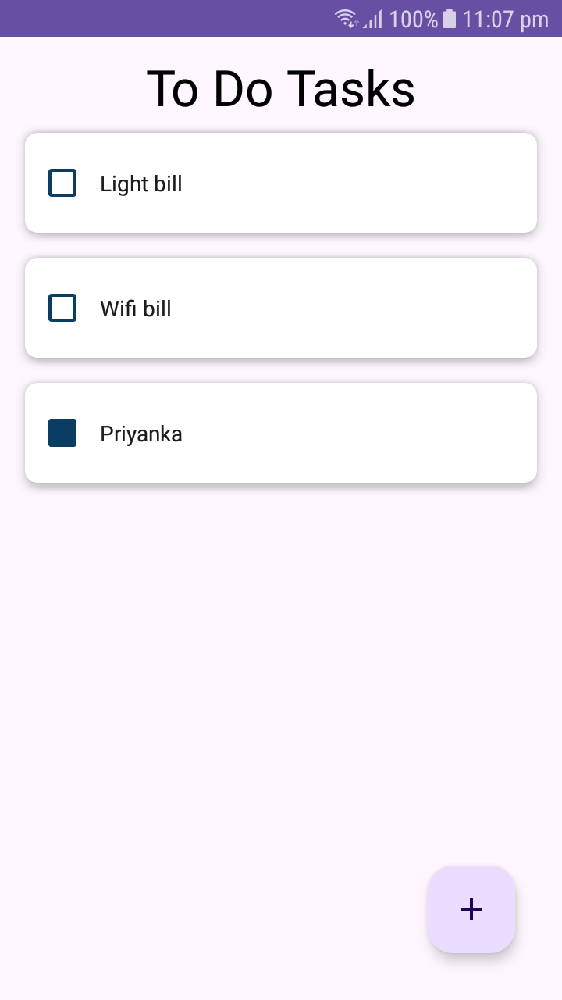
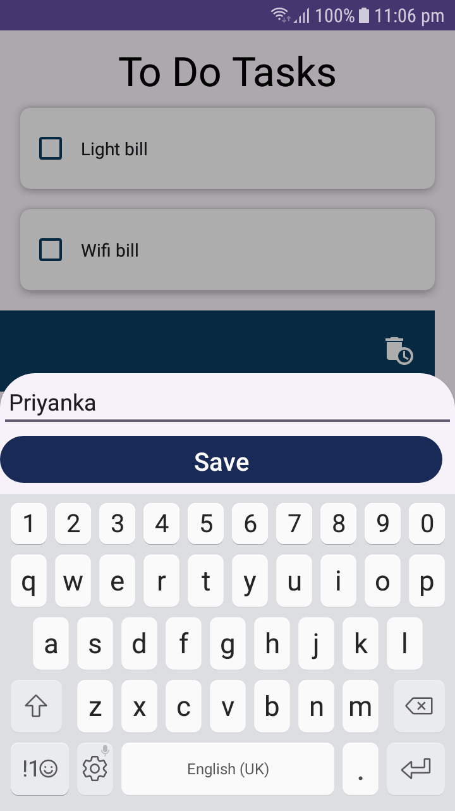

# ToDoAppAndroid

ToDoAppAndroid is a simple Android application that allows users to manage their tasks and to-do lists efficiently.

## Features

- **Task Management**: Add, edit, delete, and mark tasks as completed.
- **Intuitive User Interface**: Clean and user-friendly interface for easy task management.
- **Persistent Storage**: Tasks are stored locally using SQLite database, ensuring data persistence across app sessions.
- **Responsive Design**: Supports various screen sizes and orientations for a seamless user experience.

## Screenshots

## Getting Started

To get started

